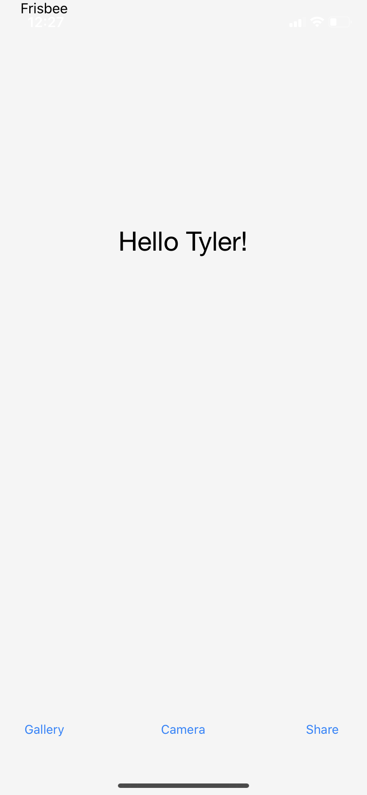

# Frisbee
> Frisbee is a cross-platform mobile camera app which allows users to create easy gif animations from a series of pictures taken from the users native phone camera.

## Table of contents
* [General info](#general-info)
* [Screenshots](#screenshots)
* [Technologies](#technologies)
* [Setup](#setup)
* [Features](#features)
* [Status](#status)
* [Inspiration](#inspiration)
* [Contact](#contact)

## General info
The purpose of this project is to create and share awesome gif images made by **you** with people across all sharing platforms, such as:
 * Facebook
 * Twitter
 * Instagram

## Screenshots



## Technologies
* Native camera support using Xamarin API - version 0.1
* Multiplatform Deployment with UI in Android or IOS using native interface buttons - version 0.2
* Tech 3 - version 3.0

## Setup
**Releases Coming Soon, Stay Tuned!**

## Code Examples
* Tyler - Using Xamarin Camera API, created a camera reference :
```
   private async void CameraButtonClicked(object sender, EventArgs e)
        {
            try
            {
                var photo = await Plugin.Media.CrossMedia.Current.TakePhotoAsync(new Plugin.Media.Abstractions.StoreCameraMediaOptions() { });
            }
            catch(Exception w)
            {
                throw new Exception(w.Message);
            }
        }
```
This segment creates a MediaCameraOptions objects which is called when the CameraButtonClicked Event is called, the resulting media options object is passed to an async TakePhoto method which uses the mobile devices native camera to take a picture which is then sent back to the MainPage. <Commit 8789ad840e588248b51c3ff7e7977c77c0958610: Working Camera Access>


*Tyler - Created a CustomRenderer for IOS which creates a webview of Facebook's login page.
```
    public override void ViewDidAppear(bool animated)
        {
            base.ViewDidAppear(animated);


            var auth = new OAuth2Authenticator(
                clientId: App.Instance.oAuthSettings.ClientId, // your OAuth2 client id
                scope: App.Instance.oAuthSettings.Scope, // the scopes for the particular API you're accessing, delimited by "+" symbols
                authorizeUrl: new Uri(App.Instance.oAuthSettings.AuthorizeUrl), // the auth URL for the service
                redirectUrl: new Uri(App.Instance.oAuthSettings.RedirectUrl)); // the redirect URL for the service

            auth.Completed += (sender, eventArgs) =>
            {
                // We presented the UI, so it's up to us to dimiss it on iOS.
                App.Instance.SuccessfulLoginAction.Invoke();

                if (eventArgs.IsAuthenticated)
                {
                    // Use eventArgs.Account to do wonderful things
                    App.Instance.SaveToken(eventArgs.Account.Properties["access_token"]);
                    //await App.Instance.facebookViewModel.SetFacebookUserProfileAsync(App.Instance.Token);
                }
                else
                {
                    // The user cancelled
                }
            };

            PresentViewController(auth.GetUI(), true, null);
        }
```

This Segment Creates a CustomRenderer for the IOS Section of our application. when the view appears, creates a webview of FAcebooks Login page. the callback URL specified in the OAuth2AuthenticatorObject specifies where the Login token is going, we can extract that token to use in our App Instance. <Commit bf880d7f05cf980bdac2d22f399c756b68e7d609: Facebook Login Fix.>

* Mario - Using Xamarin Xaml code to generate display messages for the interface
```
<Label

          x:Name= "HelloMessage"
          Text="Hello There"
          FontSize="30"
          FontFamily="HelveticaNeue"
          Grid.Row="5"
          Grid.Column="1"
          HorizontalOptions="Center"
          VerticalOptions="CenterAndExpand"
          >

      </Label>
```
This code segments creates a label called HelloMessage which displays a welcome message with the users name after it being inputed.The message is displayed in the center of the users screen along with buttons at the very bottom. <commit 1aea3fbc0545f42cb6e4ac39e37b8ff44e196e64: Main Page UI>

* Irene - using Xamarin, established buttons for SharePage :
```
   <Button
        Text="Back"
        Clicked="BackButtonClicked"
        HorizontalOptions="Start"
        VerticalOptions="Start">
    </Button>
```
This code segment here is used to create buttons that are used to navigate the Share Page of the application. The Share Page is where a user has the option to navigate to their choice of platform to upload an output from our application. <commit 2b340ca4394c32b7db421f0447029ae17da34b2b: Share Page>

* Gisele - Using Xamarin, updated the Main Page navigation :
```
  namespace Frisbee
{
    public partial class Gallery : ContentPage
    {
        public Gallery()
        {
            InitializeComponent();

        }
    }
}
```
This code segment above allows the mainPage public partial class to interact with the gallery class when the gallery button is clicked. A new gallery object is created when the button is pressed in MainPage.xaml.cs. <Commit b34e98ca33fb178012b740c4eed8a190a188e048: Main Page Navigation>
 
 
 
## Features
List of features ready and TODOs for future development
* Tyler - Ability to Log in and Take pictures with the native phone camera
* Tyler - Login With Facebook and post pictures to a variety of applications(From Frisbee and native phone gallery)
* Page navigation
* Page Layout


To-do list:
+ Allow users to save pictures
+ Tyler - Set up Camera to take multiple pictures in succession and concatenate them together
+ share created gifs across sharing services (Requires business Verification)
+ Allow Login to Twitter in addition to facebook 
+ Gisele - Set up language support 
+ Irene - Button actions - ability to share to platforms given options listed

## Status
Project is: _in progress_

## Inspiration
This project is inspired by Boomerang, a popular Instagram extension with a similar theme.

## Contact
Created by [Irene Marmelejo](), [Gisele D'Abreu](), [Mario Gomez](), and [Tyler Carroll](https://github.com/Tyler-Carroll?tab=repositories) - Contact us for questions or support
